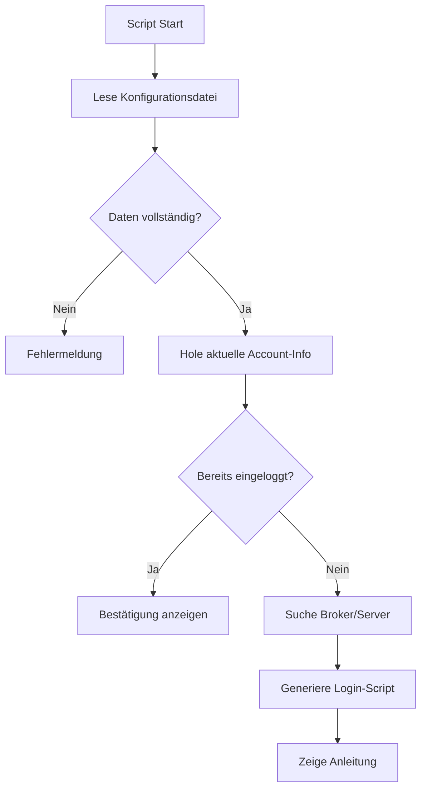

# 🔐 MT5 Auto-Login System - Vollständige Anleitung

## 📋 Inhaltsverzeichnis

1. [Übersicht](#übersicht)
2. [Installation](#installation)
3. [Konfiguration](#konfiguration)
4. [Verwendung](#verwendung)
5. [Funktionsweise](#funktionsweise)
6. [Sicherheit](#sicherheit)
7. [Fehlerbehebung](#fehlerbehebung)
8. [Erweiterte Optionen](#erweiterte-optionen)

---

## 🎯 Übersicht

Das **MT5 Auto-Login System** ermöglicht es Ihnen, Login-Daten in einer lokalen Datei zu speichern und automatisch den korrekten MetaTrader 5 Account zu verwenden.

### Features:
- ✅ **Automatisches Einlesen** von Login-Daten aus Konfigurationsdatei
- ✅ **Broker/Server-Suche** mit intelligenter Erkennung
- ✅ **Login-Status-Validierung** - prüft, ob Sie bereits eingeloggt sind
- ✅ **Batch-Script-Generierung** für Windows Auto-Login
- ✅ **Sichere Passwort-Behandlung** mit Kommentarunterstützung
- ✅ **Multi-Broker-Unterstützung** (IC Markets, Pepperstone, XM, etc.)

---

## 📦 Installation

### Schritt 1: Dateien kopieren

1. **Script-Datei kopieren:**
   ```
   src/scripts/MT5_Auto_Login.mq5
   → [MT5 Datenordner]/MQL5/Scripts/MT5_Auto_Login.mq5
   ```

2. **Konfigurationsdatei kopieren:**
   ```
   examples/mt5_login_config.txt
   → [MT5 Datenordner]/MQL5/Files/mt5_login_config.txt
   ```

### Schritt 2: MT5 Datenordner finden

**Wo ist der MT5 Datenordner?**

1. Öffnen Sie MetaTrader 5
2. Gehen Sie zu: **Datei → Datenordner öffnen**
3. Der Ordner öffnet sich automatisch

**Standard-Pfad (Windows):**
```
C:\Users\[IhrName]\AppData\Roaming\MetaQuotes\Terminal\[TerminalID]\
```

### Schritt 3: Script kompilieren

1. Öffnen Sie MetaEditor (F4 in MT5)
2. Navigieren Sie zu: **Scripts → MT5_Auto_Login.mq5**
3. Drücken Sie **F7** zum Kompilieren
4. Bestätigen Sie: "0 error(s), 0 warning(s)"

---

## ⚙️ Konfiguration

### Konfigurationsdatei bearbeiten

Öffnen Sie die Datei `mt5_login_config.txt` im MQL5/Files Ordner:

```ini
# Account-Nummer (Login)
ACCOUNT=12345678

# Passwort
PASSWORD=IhrPasswortHier

# Server-Name
SERVER=ICMarkets-Demo
```

### 🔑 Wichtige Parameter:

| Parameter | Beschreibung | Beispiel |
|-----------|--------------|----------|
| `ACCOUNT` | Ihre MT5 Account-Nummer | `12345678` |
| `PASSWORD` | Ihr Account-Passwort | `SecurePass123!` |
| `SERVER` | Broker-Server-Name | `ICMarkets-Demo` |

### 🏢 Server-Namen für bekannte Broker:

| Broker | Demo Server | Live Server |
|--------|-------------|-------------|
| **IC Markets** | `ICMarkets-Demo` | `ICMarkets-Live` |
| **Pepperstone** | `Pepperstone-Demo` | `Pepperstone-Live` |
| **XM** | `XM.COM-Demo` | `XM.COM-Real` |
| **Admiral Markets** | `AdmiralMarkets-Demo` | `AdmiralMarkets-Live` |
| **FxPro** | `FxPro.com-Demo` | `FxPro.com-Live` |
| **Roboforex** | `RoboForex-Demo` | `RoboForex-Pro` |
| **Exness** | `Exness-Demo` | `Exness-Real` |
| **FTMO** | `FTMO-Demo` | `FTMO-Server` |

**Server-Name herausfinden:**
1. Öffnen Sie MT5
2. Schauen Sie in die untere rechte Ecke
3. Der Server-Name wird neben Ihrer Account-Nummer angezeigt

---

## 🚀 Verwendung

### Methode 1: Script direkt ausführen

1. Öffnen Sie MetaTrader 5
2. **Navigator** → **Scripts** → **MT5_Auto_Login**
3. Ziehen Sie das Script auf einen Chart
4. Oder: Rechtsklick → **Auf Chart starten**

### Methode 2: Automatisches Login via Batch-Script

Das MQL5-Script generiert automatisch ein Windows Batch-Script:

1. Führen Sie `MT5_Auto_Login.mq5` einmal aus
2. Ein Batch-Script wird generiert: `mt5_auto_login.bat`
3. **Pfad:** `[MT5 Datenordner]/MQL5/Files/mt5_auto_login.bat`

**Batch-Script ausführen:**
```batch
# Doppelklick auf mt5_auto_login.bat
# MT5 startet automatisch mit Ihren Login-Daten
```

### Methode 3: Manuelle Kommandozeile

```batch
cd "C:\Program Files\MetaTrader 5"
terminal64.exe /login:12345678 /server:"ICMarkets-Demo" /password:"IhrPasswort"
```

---

## 🔍 Funktionsweise

### Was macht das Script?



### Schritt-für-Schritt:

1. **Konfiguration lesen:**
   - Öffnet `mt5_login_config.txt`
   - Parst Account, Passwort, Server

2. **Validierung:**
   - Prüft, ob alle Daten vorhanden sind
   - Validiert Format und Plausibilität

3. **Broker-Suche:**
   - Vergleicht konfigurierten Server mit aktuellem Server
   - Sucht nach Server-Varianten (Demo, Live, Real)
   - Teilstring-Matching für flexible Erkennung

4. **Status-Prüfung:**
   - Vergleicht aktuelle Account-Nummer
   - Prüft Server-Übereinstimmung
   - Validiert Verbindungsstatus

5. **Auto-Login-Vorbereitung:**
   - Generiert Batch-Script (Windows)
   - Zeigt manuelle Login-Anleitung
   - Gibt Feedback über aktuellen Status

---

## 🔒 Sicherheit

### ⚠️ WICHTIGE SICHERHEITSHINWEISE:

1. **Passwort im Klartext:**
   - Die Konfigurationsdatei speichert Ihr Passwort unverschlüsselt
   - Verwenden Sie dieses System nur auf **privaten Computern**
   - Teilen Sie die Datei **NIEMALS** mit anderen

2. **Dateiberechtigungen:**
   ```batch
   # Nur Sie sollten Zugriff haben
   # Windows: Rechtsklick → Eigenschaften → Sicherheit
   # Entfernen Sie alle Benutzer außer Ihrem eigenen Account
   ```

3. **Empfohlene Sicherheitsmaßnahmen:**
   - ✅ Verwenden Sie starke, einzigartige Passwörter
   - ✅ Aktivieren Sie 2FA auf Ihrem Broker-Account (wenn verfügbar)
   - ✅ Verschlüsseln Sie Ihre Festplatte (BitLocker/VeraCrypt)
   - ✅ Verwenden Sie ein Demo-Konto zum Testen
   - ❌ Verwenden Sie NICHT auf gemeinsam genutzten Computern
   - ❌ Speichern Sie NICHT in Cloud-Ordnern (Dropbox, OneDrive, etc.)

4. **Alternative: Umgebungsvariablen** (Fortgeschritten)
   ```batch
   # Setzen Sie Umgebungsvariablen statt Klartext
   set MT5_PASSWORD=IhrPasswort
   # Referenzieren Sie diese im Script
   ```

---

## 🛠️ Fehlerbehebung

### Problem: "Konfigurationsdatei konnte nicht gelesen werden"

**Lösung:**
1. Prüfen Sie den Dateipfad:
   ```
   [MT5 Datenordner]/MQL5/Files/mt5_login_config.txt
   ```
2. Stellen Sie sicher, dass die Datei existiert
3. Prüfen Sie die Dateiberechtigungen

### Problem: "Server nicht gefunden"

**Lösung:**
1. Prüfen Sie den Server-Namen:
   - Öffnen Sie MT5
   - Schauen Sie in die Statusleiste (unten rechts)
   - Notieren Sie den exakten Server-Namen

2. Häufige Server-Name-Varianten:
   ```
   ICMarkets-Demo
   ICMarkets-Demo01
   ICMarkets-Demo-Server
   ```

3. Verwenden Sie den exakten Namen aus MT5

### Problem: "Bereits mit anderem Account eingeloggt"

**Lösung:**
1. Führen Sie das generierte Batch-Script aus
2. Oder: Manuell in MT5:
   - **Datei → Bei Handelskonto anmelden**
   - Geben Sie die Daten aus der Konfigurationsdatei ein

### Problem: "Batch-Script funktioniert nicht"

**Lösung:**
1. Prüfen Sie den MT5-Installationspfad im Batch-Script:
   ```batch
   set MT5_PATH="C:\Program Files\MetaTrader 5\terminal64.exe"
   ```

2. Häufige alternative Pfade:
   ```batch
   "C:\Program Files (x86)\MetaTrader 5\terminal64.exe"
   "C:\Program Files\[BrokerName]\MetaTrader 5\terminal64.exe"
   ```

3. Passen Sie den Pfad im generierten Batch-Script an

### Problem: "Passwort wird nicht akzeptiert"

**Lösung:**
1. Prüfen Sie auf Sonderzeichen im Passwort:
   - Vermeiden Sie: `"`, `'`, `\`, `$` in Passwörtern
   - Oder escapen Sie diese korrekt

2. Testen Sie das Passwort manuell in MT5

3. Setzen Sie ggf. ein neues Passwort beim Broker

---

## 🚀 Erweiterte Optionen

### Script-Parameter anpassen

Bei der Ausführung können Sie Parameter ändern:

```mql5
input string ConfigFileName = "mt5_login_config.txt";  // Anderer Dateiname
input bool   DebugMode = true;                         // Debug-Ausgaben
```

**Eigene Konfigurationsdatei verwenden:**
1. Erstellen Sie z.B. `my_broker_config.txt`
2. Ändern Sie beim Script-Start `ConfigFileName` zu `my_broker_config.txt`

### Mehrere Accounts verwalten

Erstellen Sie mehrere Konfigurationsdateien:
```
mt5_login_demo.txt      # Demo Account
mt5_login_live.txt      # Live Account
mt5_login_prop.txt      # Prop Firm Account
```

**Verwendung:**
```
Führen Sie das Script aus und wählen Sie die entsprechende Datei
```

### Integration in Expert Advisor

Sie können die Login-Validierung auch in Ihren EA integrieren:

```mql5
#include "MT5_Auto_Login.mq5"

void OnInit()
{
   LoginData loginData;
   if(ReadLoginConfig("mt5_login_config.txt", loginData))
   {
      // Prüfen Sie, ob Sie mit dem richtigen Account eingeloggt sind
      if(AccountInfoInteger(ACCOUNT_LOGIN) != loginData.account)
      {
         Alert("WARNUNG: Sie sind mit dem falschen Account eingeloggt!");
         return INIT_FAILED;
      }
   }
}
```

### Automatischer Start bei Windows-Boot

**Windows Task Scheduler verwenden:**

1. Öffnen Sie **Aufgabenplanung** (Task Scheduler)
2. **Aktion → Neue Aufgabe erstellen**
3. **Trigger:** Bei Anmeldung
4. **Aktion:** Programm starten
   - Programm: `C:\...\mt5_auto_login.bat`
5. **Speichern**

---

## 📊 Script-Ausgabe verstehen

### Erfolgreicher Login:
```
═══════════════════════════════════════════════════════════
     MT5 Auto-Login Script v1.0 - Stelona
═══════════════════════════════════════════════════════════

--- AKTUELLE VERBINDUNG ---
Account: 12345678
Server:  ICMarkets-Demo
Broker:  IC Markets

--- KONFIGURIERTE DATEN ---
Account: 12345678
Server:  ICMarkets-Demo

--- BROKER-SUCHE ---
✓ Server gefunden: ICMarkets-Demo
  Dies ist Ihr aktueller Server

--- LOGIN-STATUS ---
✓ SIE SIND BEREITS MIT DEM KORREKTEN ACCOUNT EINGELOGGT!
✓ Account: 12345678
✓ Server:  ICMarkets-Demo
✓ Verbindung aktiv

--- ACCOUNT-INFORMATIONEN ---
Name:           John Doe
Balance:        10000.00 USD
Eigenkapital:   10000.00 USD
Hebel:          1:500
Handelserlaubt: Ja
Expert Advisors:Erlaubt

═══════════════════════════════════════════════════════════
     Auto-Login Check abgeschlossen
═══════════════════════════════════════════════════════════
```

---

## 📞 Support

### Probleme oder Fragen?

1. **Dokumentation prüfen:** Lesen Sie diese Anleitung vollständig
2. **Logs prüfen:** Schauen Sie in das **Expert-Journal** in MT5
3. **Debug-Modus:** Aktivieren Sie `DebugMode = true` im Script
4. **Support kontaktieren:** [support@stelona.com](mailto:support@stelona.com)

---

## 📝 Changelog

### Version 1.0 (2024)
- ✅ Initiale Version
- ✅ Konfigurationsdatei-Parsing
- ✅ Broker/Server-Suche
- ✅ Login-Status-Validierung
- ✅ Batch-Script-Generierung
- ✅ Umfassende Fehlerbehandlung

---

## 📄 Lizenz

Copyright 2024 Stelona. Alle Rechte vorbehalten.

Nur für autorisierte Nutzung. Kontaktieren Sie [support@stelona.com](mailto:support@stelona.com) für Lizenzinformationen.

---

**© 2024 Stelona. All rights reserved.**
